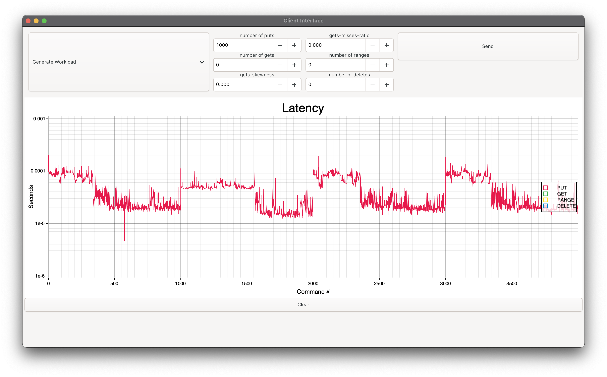

Key-value database built on a Log-Structured Merge Tree (LSM-tree) 

- Bloom filters and indexes for faster lookups
- In-memory and compaction with on-disk sorted tables
- Handles GET, PUT, DELETE, LOAD, RANGE, and STATS commands. 
- A client which can be ran over a simple terminal interface or a GTK-based GUI:


*Client GUI showing latency spikes at the start of each batch of 1,000 PUT requests, most likely caused by cache warm-up*


## Server

### Build
```shell
cargo build --release
```

### Run
```
./target/release/lsm-tree [--port port] [--data-dir dir]
```

## Client

### Build
```shell
cd lsm-tree-client; cargo build --release
```

### Run
```
./target/release/lsm-tree-client [--port port] [--cli]
```

## Useful commands

- Record diskio usage and stdout of server (macOS only):

```shell
./target/release/lsm-tree > out.txt &; sudo fs_usage -w -f filesys $last_pid
```

- Feed `generator` to client through --cli option:

```
cd lsm-tree-client; ./generator/generator --puts 1000000 --gets 10000 --deletes 20000 --gets-misses-ratio 0.3 --gets-skewness 0.2 --gaussian-ranges | ./target/release/lsm-tree-client --cli
```